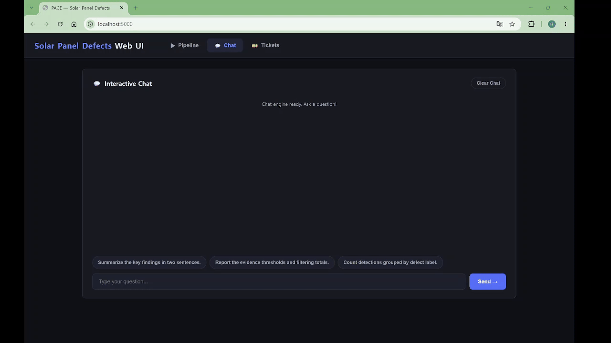
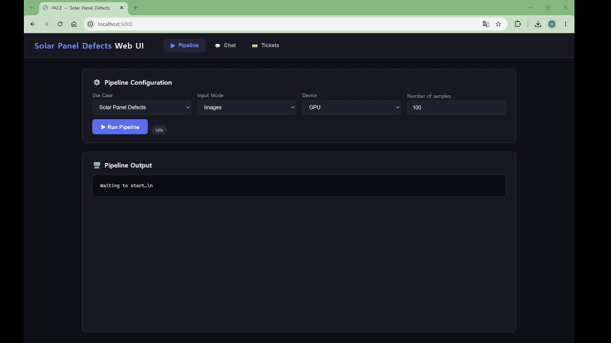

# Google Summer of Code 2026 Project

**Contributor:** Hyeongseob Jo  
**Organization:** Intel / OpenVINO Toolkit
**Project:** Agentic AI for Predictive Maintenance using OpenVINO  
**Repository:** [intel/predictive-maintenance-pipeline](https://github.com/intel/predictive-maintenance-pipeline)

**GSoC Project Page:** [Project Details](https://summerofcode.withgoogle.com/programs/2026/projects/yvVZsgrT)

**Intel Mentors:**
- Hassnaa Moustafa
- Anand Bodas
- Rohit Verma

This repository summarizes my Google Summer of Code (GSoC) 2026 leveraging Intel Metro AI Suite Predictive Maintenance Pipeline using OpenVINO for AI Inference. The detailed work is organized into features to clearly present each contribution.

## Demo
The demo shows the unified chat interface providing access to inference results, agent-generated reports, and database queries across multiple predictive maintenance use cases.

## Work Summary

- [Feature 1: Chatbot Integration](docs/feature1-unified-chat-interface.md) - Added intent routing and a unified chat flow for analysis, evidence, and SQL questions.
- [Feature 2: SQL Schema Support](docs/feature2-sql-schema-support.md) - Added raw sensor data to SQLite for sensor-aware reports and natural-language SQL queries.
- [Feature 3: Inference Dispatcher Refactoring](docs/feature3-inference-refactor.md) - Refactored inference into handlers, writers, config builders, and reusable runners.
- **Feature 4: Addition of New Use Cases**
  1. [Oil and Gas Pipeline](docs/feature4-oil-gas-pipeline.md) - Added condition classification, thickness-loss regression, and corrosion analysis for pipeline sensor data.
  2. [Solar Panel Defects](docs/feature4-solar-panel-defects.md) - Added OpenVINO object detection and agent analysis for solar-cell electroluminescence images.
  3. [Power Transmission Inspection](docs/feature4-power-transmission-inspection.md) - Added OpenVINO image classification, agent report generation, and CLI and Web UI chat verification.
  4. [Manufacturing Maintenance](docs/feature4-manufacturing-maintenance.md) - Added multimodal acoustic and text classification with evidence ingestion and ticket generation.
  5. [Water Treatment](docs/feature4-water-treatment.md) - Added late-fusion irrigation classification from paired satellite raster patches and environmental text prompts.

## Datasets Used

The inference models listed below were deployed in OpenVINO IR format.

| Use Case | Dataset | Input | Model and Multimodal Processing | Access |
|---|---|---|---|---|
| Pipeline Defect Detection | Pipeline Defect Dataset | Pipeline inspection images with six bounding-box defect classes | YOLOv8 object detector exported to OpenVINO IR | [Kaggle](https://www.kaggle.com/datasets/simplexitypipeline/pipeline-defect-dataset) |
| Gas Detection | MultimodalGasData | Thermal images + seven MQ-series gas-sensor readings | Fine-tuned YOLOv8s-cls image classifier + sensor MLP trained from scratch, with 0.6/0.4 late fusion | [Mendeley Data](https://data.mendeley.com/datasets/zkwgkjkjn9/2) |
| Oil and Gas Pipeline | Predictive Maintenance Oil and Gas Pipeline Data | Tabular operational and material features | Sensor MLP trained from scratch for condition classification and thickness-loss regression | [Kaggle](https://www.kaggle.com/datasets/muhammadwaqas023/predictive-maintenance-oil-and-gas-pipeline-data) |
| Solar Panel Defects | PVEL-AD | Single-channel electroluminescence images with 12 bounding-box defect classes | Fine-tuned Ultralytics YOLO object detector; exact YOLO version not specified | [GitHub](https://github.com/binyisu/PVEL-AD) |
| Power Transmission Inspection | Power Transmission Line Dataset | RGB images with three circuit configuration classes | Fine-tuned YOLOv8s-cls image classifier | [IEEE DataPort](https://ieee-dataport.org/documents/power-transmission-line-dataset) |
| Manufacturing Maintenance | E-MM1 | Audio clips + human-written captions mapped to five acoustic event categories | Audio-feature MLP + TF-IDF text MLP with 0.5/0.5 late fusion | [GitHub](https://github.com/encord-team/E-MM1) |
| Water Treatment | IRRISIGHT | Sentinel-2 multichannel raster patches + environmental text prompts for four irrigation categories | Raster-feature MLP + TF-IDF text MLP with 0.5/0.5 late fusion | [GitHub](https://github.com/Nibir088/IRRISIGHT) / [Hugging Face](https://huggingface.co/datasets/OBH30/IRRISIGHT) |

## Pull Requests

- Features 1, 2, and 3: [PR #5](https://github.com/intel/predictive-maintenance-pipeline/pull/5)
- Feature 4 - Oil and Gas Pipeline: [PR #6](https://github.com/intel/predictive-maintenance-pipeline/pull/6)
- Feature 4 - Solar Panel Defects: [PR #8](https://github.com/intel/predictive-maintenance-pipeline/pull/8)
- Feature 4 - Power Transmission Inspection: [PR #9](https://github.com/intel/predictive-maintenance-pipeline/pull/9)
- Feature 4 - Manufacturing Maintenance and Water Treatment: [PR #10](https://github.com/intel/predictive-maintenance-pipeline/pull/10)

## Testing and Validation
Detailed validation commands and examples are available in [Pipeline Run and Validation](docs/pipeline-run-and-validation.md).

## Final Submission Note

This repository serves as the public GSoC final project summary. All planned
GSoC tasks were completed and validated, and their implementations are
documented here with links to the corresponding upstream pull requests.
