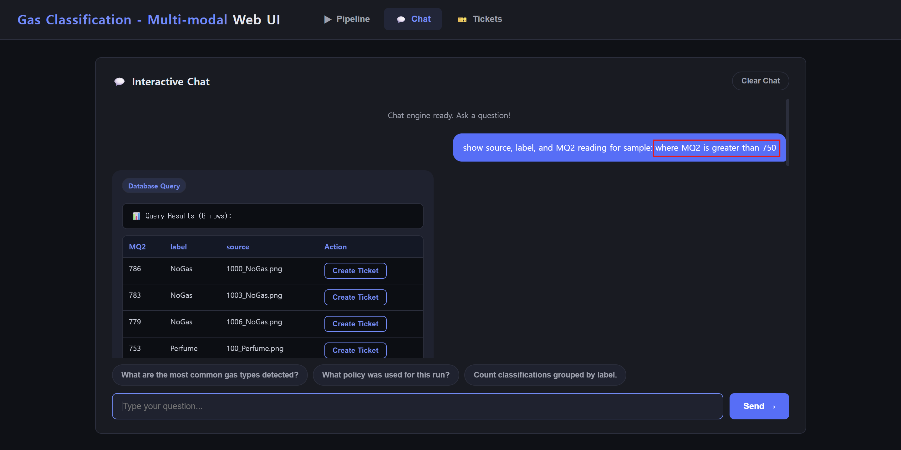

# Feature 2: SQL Schema Support

This feature extended the existing database and agent layer to store raw sensor readings alongside inference results. This enables sensor-aware SQL queries, policy decisions, and analysis reports.

## Key Work

- Extended the configurable SQLite schema with raw sensor readings, modality-specific metadata, and confidence fields.
- Updated the SQL schema description to support natural-language queries over sensor fields.
- Updated the policy and analysis layers to use sensor values and modality-specific confidence information.
- Added schema backfilling and tests for SQL queries and sensor-aware agent behavior.


## Result



The pipeline can now preserve sensor context for each prediction. Alongside labels and confidence scores, the database can store raw sensor readings and modality-specific confidence values. This enables more detailed natural-language queries and sensor-aware agent reports.


## Example

Before this feature, a result row mainly represented the final prediction:

```text
source, label, confidence
```

After this feature, a result row can also include raw sensor readings and modality-specific confidence information:

```text
source, label, confidence, sensor_raw_json, image_confidence, sensor_confidence
```

This richer schema helps answer questions such as:

- Which samples had high sensor confidence?
- Which samples had higher image confidence than sensor confidence?
- Which raw sensor values may help explain the final prediction?
