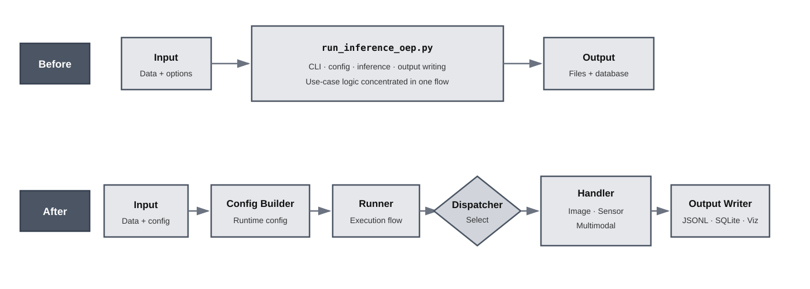

# Feature 3: Inference Dispatcher Refactoring

This feature refactored the inference execution flow so `run_inference_oep.py` became a thin CLI entry point instead of containing most of the inference, output, and configuration logic directly.

## Architecture

The refactor separated the original monolithic inference flow into reusable
configuration, execution, dispatch, handler, and output-writing components.

## Key Work

- Added an inference handler interface and handler registry.
- Added dispatcher-based handler selection from configuration.
- Moved model-specific inference execution into handler modules.
- Moved handler config construction into a separate config builder.
- Moved output writing, SQLite row creation, and visualization logic into separate modules.
- Moved the main inference runner logic into a reusable runner module.
- Added configurable agent graph support through `agents.active`.
- Added a new use-case scaffold script for consistent use-case setup.

## Main Modules Added or Updated

- `src/inference/handler.py`
- `src/inference/registry.py`
- `src/inference/dispatcher.py`
- `src/inference/config_builder.py`
- `src/inference/inference_runner.py`
- `src/inference/output_writer.py`
- `src/inference/visualization.py`
- `src/agents/graph_builder.py`
- `scripts/new_usecase.py`

## Result

The inference pipeline became easier to extend and maintain. New use cases can now be added through config files, handler modules, and scaffolded use-case folders instead of repeatedly modifying one large inference script. The refactor also made Feature 4 safer because new use-case-specific logic can be added in focused modules.
