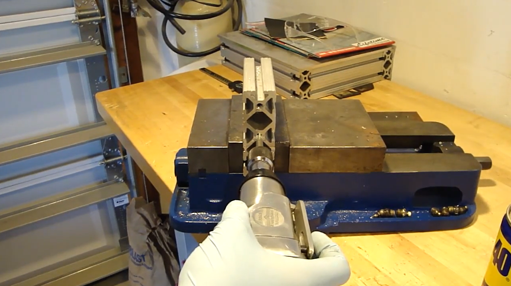
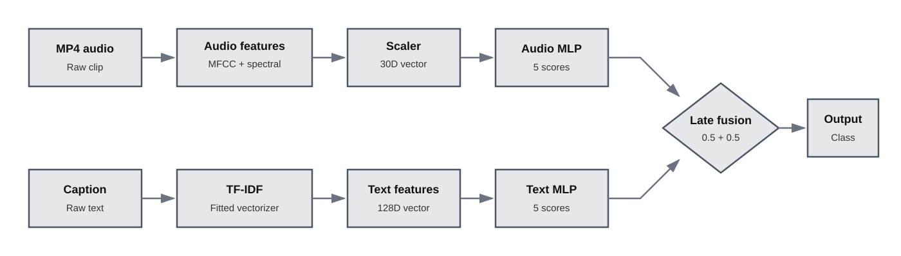
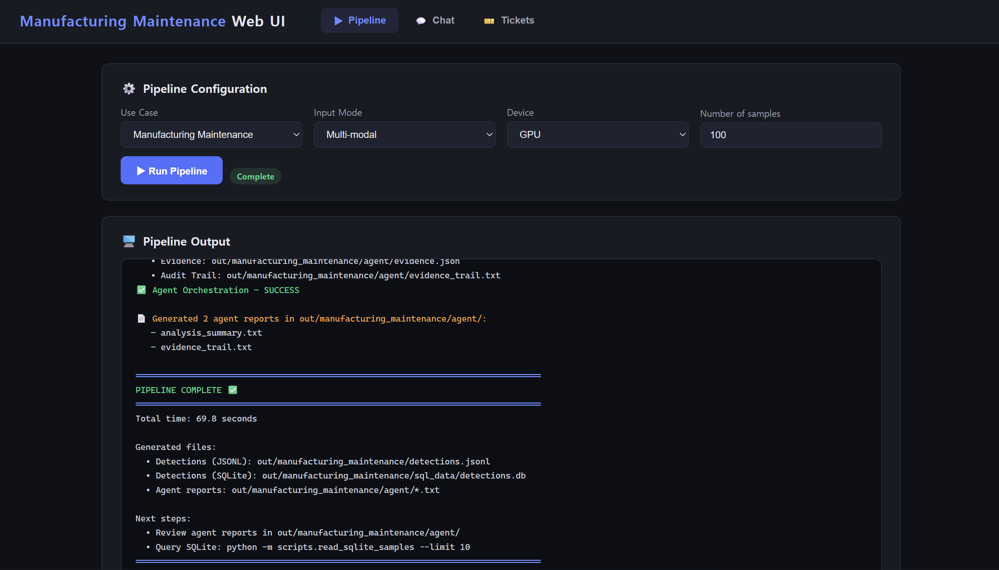

# Feature 4: Manufacturing Maintenance

The Manufacturing Maintenance use case classifies paired audio clips and text
captions into five acoustic event categories through multimodal late fusion.

## Dataset

- E-MM1 audio-text dataset
- Modalities: audio clips and paired text captions
- Input audio: MP4 clips of up to 10 seconds
- Local pipeline validation subset: 100 paired samples
- Source: [E-MM1 on GitHub](https://github.com/Encord-Team/encord-active/tree/main/examples/embeddings/e-mm1)

The five acoustic event classes are:

| Class | Description |
|---|---|
| `alert_signal` | Alarms, warning tones, and other alert sounds |
| `ambient_normal` | Normal ambient or background sound |
| `impact_event` | Impacts, knocks, and collision-like sounds |
| `rotating_machinery` | Power tools and rotating mechanical equipment |
| `vehicle_engine` | Engine and vehicle-related sounds |

These categories act as maintenance-oriented acoustic event labels; classes
other than `ambient_normal` do not necessarily indicate confirmed equipment
failures.

### Representative sample

[Play or download the representative MP4 audio clip](../assets/feature4/manufacturing-maintenance/dataset-sample-rotating-machinery.mp4)

| Field | Value |
|---|---|
| **Ground-truth label** | **`rotating_machinery`** |
| Source dataset | AudioCaps |
| Encord audio ID | `106906` |
| Encord text ID | `289329` |
| YouTube ID | `_XLGCt5UQGM` |
| Time range | 170–180 seconds |
| File name | `_XLGCt5UQGM_170.mp4` |
| Caption | A power tool vibrates as it runs |

The bold value is the ground-truth label used to evaluate the classifier. The
sample remains in MP4 format because audio is a model input; converting it to a
GIF would remove the sound.

## Preprocessing

Preprocessing is an essential part of this use case because the OpenVINO
models consume fixed-length feature vectors rather than raw audio files or raw
caption strings.

### Audio preprocessing

Each audio clip is decoded, converted to mono, and resampled to the configured
sample rate. The preprocessing pipeline then extracts a 30-dimensional feature
vector consisting of:

- the means and standard deviations of 13 MFCC coefficients (26 values);
- zero-crossing rate;
- spectral rolloff;
- spectral centroid; and
- RMS energy.

The resulting feature vector is normalized using the fitted audio scaler before
being passed to the OpenVINO audio branch.

### Text preprocessing

Each paired caption is transformed using the fitted TF-IDF vectorizer. The
result is a 128-dimensional text feature vector that matches the input expected
by the OpenVINO text branch.

The fitted scaler, TF-IDF vocabulary, feature ordering, and class ordering must
remain consistent with the exported models. Without these preprocessing
artifacts, the raw dataset samples cannot be passed directly to the two model
branches.

## Model

The use case runs two small multi-layer perceptron classification branches in
OpenVINO and combines their outputs through late fusion.

### Audio branch

- Input: 30-dimensional handcrafted acoustic feature vector
- Output: `[?, 5]`, one score for each acoustic event class

### Text branch

- Input: 128-dimensional TF-IDF representation of the paired caption
- Output: `[?, 5]`, one score for each acoustic event class

The default fusion weights are `0.5` for audio and `0.5` for text. The weighted
branch scores are combined before the final class and confidence are selected.

## Inference Flow

The complete inference flow transforms the paired raw inputs, runs the audio
and text model branches, and combines their class scores through late fusion.

## Key Work

- Added the `manufacturing_maintenance` use-case configuration, schema,
  prompts, and policy.
- Added an OpenVINO audio-text classification handler with paired-input
  preprocessing and late fusion.
- Stored the fused class, fused confidence, branch confidences, and caption
  evidence in JSONL and SQLite.
- Integrated confidence-policy filtering and the standard analysis and evidence
  agents.
- Added CLI and Web UI support for multimodal inference, chat queries, and
  ticket generation.

## Validation

- Evaluation on the reproduced 53-sample validation split produced:
  - 22 correct fused predictions
  - accuracy: 0.4151
- Inference on the complete 100-sample local subset produced:
  - 100 JSONL classification records
  - 100 SQLite rows
  - audio and text branch confidence values for every sample
- One tested orchestration run produced:
  - 24 policy-accepted classifications
  - 76 filtered classifications
- Analysis, evidence, and SQL chat modes were verified in both the CLI and Web
  UI.

The reproduced validation accuracy describes the supplied fused model with the
reconstructed preprocessing artifacts, rather than the performance of the
pipeline orchestration or Web UI. Policy counts are run-specific because the
generated thresholds can vary between runs.

## Use Case Result

The Manufacturing Maintenance use case was validated through OpenVINO
audio-text classification, late fusion, JSONL and SQLite storage,
agent-generated reports, and CLI and Web UI interaction.

