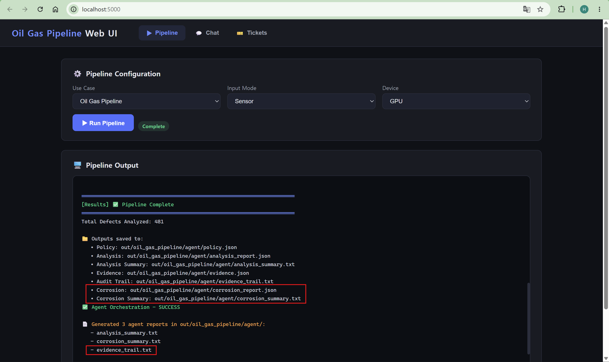

# Feature 4: Oil and Gas Pipeline

The Oil and Gas Pipeline use case uses tabular sensor data to predict pipeline condition and thickness loss.

## Dataset

- Predictive Maintenance Oil and Gas Pipeline dataset
- Source: [Kaggle - MIT License](https://www.kaggle.com/datasets/muhammadwaqas023/predictive-maintenance-oil-and-gas-pipeline-data)

## Model

- Multi-layer perceptron model exported to OpenVINO IR
- Input: tabular sensor feature vector
- Outputs:
  - pipeline condition classification
  - predicted thickness loss regression

## Key Work

- Added the `oil_gas_pipeline` use-case configuration, schema, and documentation.
- Extended the sensor inference flow for condition classification and thickness-loss regression.
- Added degradation-aware SQLite output, policy filtering, and analysis summaries.
- Added a corrosion-specific agent and connected corrosion-related chat routing.
- Added Web UI support and tests for routing, SQLite output, and agent artifacts.

## Validation

- CLI inference processed 1,000 sensor samples.
- SQLite output was generated successfully.
- Agent outputs were generated successfully:
  - `analysis_summary.txt`
  - `evidence_trail.txt`
  - `corrosion_summary.txt`
- Chat routing correctly detected corrosion-related questions.

## Use Case Result

The Oil and Gas Pipeline use case was validated through inference output, SQLite storage, agent summaries, and corrosion-specific chat routing.

