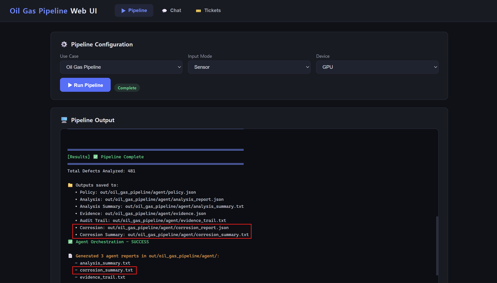

# Feature 4: Oil and Gas Pipeline

The Oil and Gas Pipeline use case uses tabular sensor data to predict pipeline condition and thickness loss.

## Dataset

- Predictive Maintenance Oil and Gas Pipeline dataset
- Source: [Kaggle - MIT License](https://www.kaggle.com/datasets/muhammadwaqas023/predictive-maintenance-oil-and-gas-pipeline-data)

### Representative samples

The dataset contains tabular records describing pipeline dimensions, material
properties, operating conditions, corrosion impact, and observed condition.

| Field | Sample 1 | Sample 2 | Sample 3 | Sample 4 | Sample 5 |
|---|---|---|---|---|---|
| Pipe size (mm) | 800 | 800 | 400 | 1500 | 1500 |
| Thickness (mm) | 15.48 | 22.0 | 12.05 | 38.72 | 24.32 |
| Material | Carbon Steel | PVC | Carbon Steel | Carbon Steel | HDPE |
| Grade | ASTM A333 Grade 6 | ASTM A106 Grade B | API 5L X52 | API 5L X42 | API 5L X65 |
| Maximum pressure (psi) | 300 | 150 | 2500 | 1500 | 1500 |
| Temperature (°C) | 84.9 | 14.1 | 0.6 | 52.7 | 11.7 |
| Corrosion impact (%) | 16.04 | 7.38 | 2.12 | 5.58 | 12.29 |
| **Thickness loss (mm)** | **4.91** | **7.32** | **6.32** | **6.2** | **8.58** |
| Material loss (%) | 31.72 | 33.27 | 52.45 | 16.01 | 35.28 |
| Time (years) | 2 | 4 | 7 | 19 | 20 |
| **Condition** | **Moderate** | **Critical** | **Critical** | **Critical** | **Critical** |

The bold rows are the ground-truth targets used by the model: thickness loss
for regression and condition for classification.

## Model

- Multi-layer perceptron model exported to OpenVINO IR
- Input: tabular sensor feature vector
- Outputs:
  - pipeline condition classification
  - predicted thickness loss regression

## Key Work

- Added the `oil_gas_pipeline` use-case configuration, schema, and documentation.
- Extended the sensor inference flow for condition classification and thickness-loss regression.
- Added degradation-aware SQLite output, policy filtering, and analysis summaries.
- Added a corrosion-specific agent and connected corrosion-related chat routing.
- Added Web UI support and tests for routing, SQLite output, and agent artifacts.

## Validation

- CLI inference processed 1,000 sensor samples.
- SQLite output was generated successfully.
- Agent outputs were generated successfully:
  - `analysis_summary.txt`
  - `evidence_trail.txt`
  - `corrosion_summary.txt`
- Chat routing correctly detected corrosion-related questions.

## Use Case Result

The Oil and Gas Pipeline use case was validated through inference output, SQLite storage, agent summaries, and corrosion-specific chat routing.

