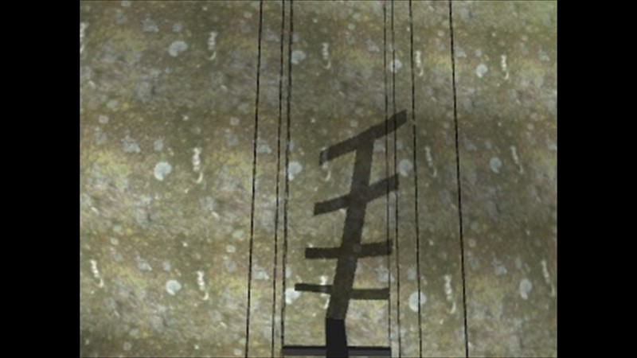
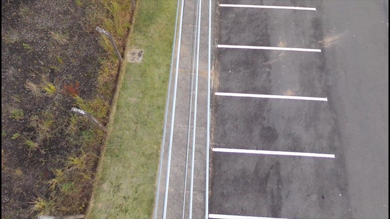
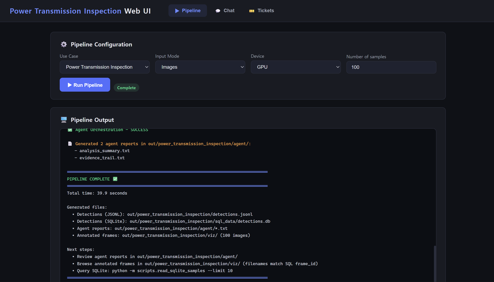

# Feature 4: Power Transmission Inspection

The Power Transmission Inspection use case classifies RGB images into three
power-transmission circuit categories.

## Dataset

- Power Transmission Line Dataset
- Modality: RGB images
- Feature: image classification
- Test set: 348 images, with 116 images per class
- Source: [IEEE DataPort](https://ieee-dataport.org/documents/power-transmission-line-dataset)

The test set contains both synthetic and real-world scenes:

| Class | Data type | Description |
|---|---|---|
| `circuito_duplo` | Synthetic | Double-circuit transmission scene |
| `circuito_real` | Real-world | Real transmission scene |
| `circuito_simples` | Synthetic | Single-circuit transmission scene |

### Representative samples

<table>
  <tr>
    <th width="50%">Synthetic sample</th>
    <th width="50%">Real-world sample</th>
  </tr>
  <tr>
    <td></td>
    <td></td>
  </tr>
  <tr>
    <td>Ground-truth class: <strong><code>circuito_duplo</code></strong></td>
    <td>Ground-truth class: <strong><code>circuito_real</code></strong></td>
  </tr>
</table>

The bold class names are the ground-truth labels used to evaluate the image
classifier.

## Model

- Fine-tuned Ultralytics **YOLOv8s-cls** image-classification model
- Export format: OpenVINO IR
- Input: `[1, 3, 640, 640]`, FP32
- Output: `[1, 3]`, one score for each circuit class
- Inference device: Intel integrated GPU using OpenVINO

## Key Work

- Added the `power_transmission_inspection` use-case configuration, schema,
  prompts, and policy.
- Reused the common OpenVINO image-classification handler for RGB inference.
- Stored image classifications in JSONL and SQLite.
- Integrated confidence-policy filtering and the standard analysis and evidence
  agents.
- Verified the pipeline and chat system through both the CLI and Web UI.

## Validation

- Evaluated all 348 held-out test images.
- Correctly classified 334 images and misclassified 14.
- Achieved `0.9598` accuracy with `0.9788` mean prediction confidence.
- Classified all 116 real-world `circuito_real` images correctly.
- All 14 errors occurred between the two synthetic circuit classes.

## Use Case Result

The Power Transmission Inspection use case was validated through OpenVINO
image classification, JSONL and SQLite storage, agent-generated analysis and
evidence reports, and CLI and Web UI chat queries.

