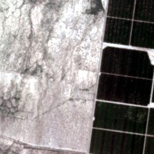
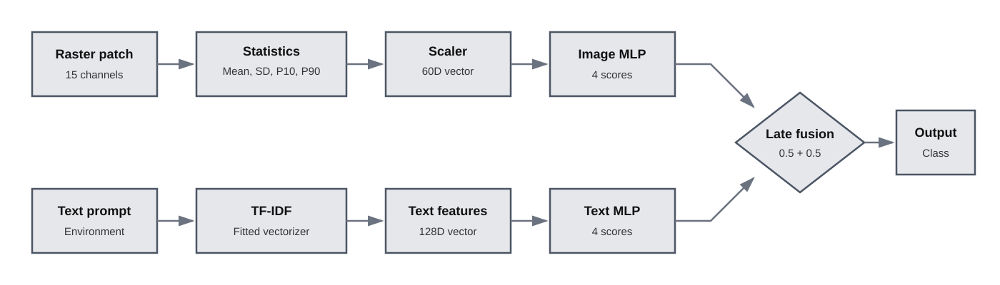
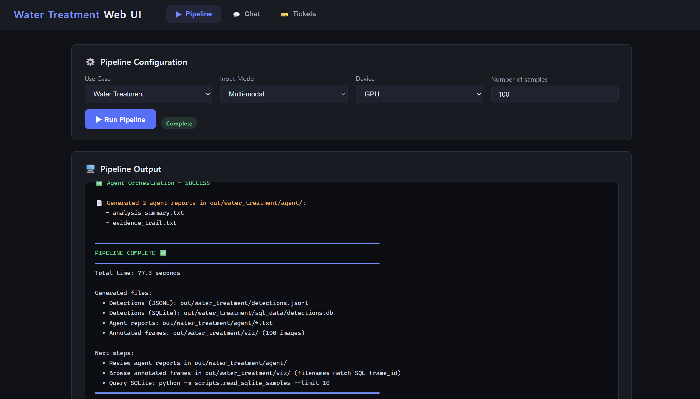

# Feature 4: Water Treatment

The Water Treatment use case classifies paired satellite raster patches and
environmental text prompts into four irrigation categories through multimodal
late fusion.

## Dataset

- IRRISIGHT dataset
- Modalities: Sentinel-2 multichannel raster patches and environmental text
  prompts
- Downloaded subset: 500 Arizona patches
- Curated local subset: 121 paired samples
- Sources: [GitHub](https://github.com/Nibir088/IRRISIGHT) / [Hugging Face](https://huggingface.co/datasets/OBH30/IRRISIGHT)

The confidence filter and per-class cap produced the following curated subset:

| Class | Samples |
|---|---:|
| `flood` | 50 |
| `sprinkler` | 50 |
| `drip` | 14 |
| `non_irrigated` | 7 |
| **Total** | **121** |

The per-class cap limits the majority classes but cannot create additional
minority-class observations, so the curated subset remains imbalanced.

### Representative sample

<table>
  <tr>
    <td width="45%"></td>
    <td>
      <strong>Ground-truth class:</strong> <strong><code>drip</code></strong> 
      <strong>State:</strong> Arizona 
      <strong>County:</strong> Cochise County 
      <strong>Label type:</strong> synthetic 
      <strong>Label confidence:</strong> 0.884968 
      <strong>Original raster shape:</strong> 15 × 224 × 224 
      <strong>Evapotranspiration:</strong> 81.26 mm 
      <strong>Precipitation:</strong> 0.00 in
    </td>
  </tr>
</table>

The bold class is the ground-truth label used to evaluate the classifier. The
displayed JPEG is a three-channel preview of the original 15-channel NumPy
raster patch; it is not the raw model input or necessarily calibrated natural
color.

## Preprocessing

Preprocessing is required because the OpenVINO models consume fixed-length
feature vectors rather than raw raster arrays or raw text strings.

### Image preprocessing

For each of the raster patch's 15 channels, the handler calculates:

- mean;
- standard deviation;
- 10th percentile; and
- 90th percentile.

These statistics form a 60-dimensional image feature vector, which is
normalized with the fitted image scaler before inference.

### Text preprocessing

The environmental prompt paired with each patch is transformed using the
fitted TF-IDF vectorizer. The resulting 128-dimensional feature vector matches
the input expected by the text branch.

The fitted scaler, TF-IDF vocabulary, feature ordering, and class ordering must
remain consistent with the exported models.

## Model

The use case runs two small multi-layer perceptron classification branches in
OpenVINO and combines their outputs through late fusion.

### Image branch

- Input: 60-dimensional handcrafted raster feature vector
- Output: `[?, 4]`, one score for each irrigation class

### Text branch

- Input: 128-dimensional TF-IDF environmental text vector
- Output: `[?, 4]`, one score for each irrigation class

The default fusion weights are `0.5` for image and `0.5` for text. The weighted
branch logits are combined before softmax produces the fused probabilities.

The originally supplied OpenVINO files did not include the fitted scaler and
TF-IDF vectorizer required to reproduce their input preprocessing. A complete,
matching model and preprocessing set was therefore trained from scratch on the
curated Arizona subset. This was not fine-tuning of the supplied model.

## Inference Flow

The complete inference flow converts both raw inputs into model-compatible
features, executes the two OpenVINO branches, and combines their scores through
late fusion.

## Key Work

- Added the `water_treatment` use-case configuration, schema, prompts, and
  policy.
- Added an OpenVINO image-text classification handler with paired-input
  preprocessing and late fusion.
- Stored fused predictions, branch confidences, environmental prompts, and
  raster traceability data in JSONL and SQLite.
- Added configurable JPEG raster previews for Web UI ticket generation without
  adding Task H-specific behavior to the shared ticket code.
- Integrated policy filtering, analysis and evidence agents, CLI chat, and Web
  UI database queries.

## Validation

- The selected stratified validation run produced:
  - overall accuracy: 0.72
  - `non_irrigated` accuracy: 0.50
  - `flood` accuracy: 0.80
  - `sprinkler` accuracy: 0.60
  - `drip` accuracy: 1.00
- Full-manifest inference on all 121 curated samples produced:
  - 98 label agreements
  - agreement rate: 0.8099
- End-to-end inference on the first 100 manifest samples produced:
  - 100 JSONL classification records
  - 100 SQLite rows
  - 100 raster preview images
- One verified orchestration run produced:
  - 14 policy-accepted classifications
  - 86 filtered classifications
- Analysis, evidence, and SQL chat modes and raster-preview ticket generation
  were verified through the CLI and Web UI.

The per-class validation results are based on a small stratified split,
especially for the minority classes. The 121-sample agreement is an integration
check rather than independent test accuracy because the curated subset also
contributed to training. Policy counts are run-specific because generated
thresholds can vary.

## Use Case Result

The Water Treatment use case was validated through OpenVINO image-text
classification, late fusion, JSONL and SQLite storage, agent-generated reports,
CLI and Web UI interaction, and ticket creation with raster previews.

