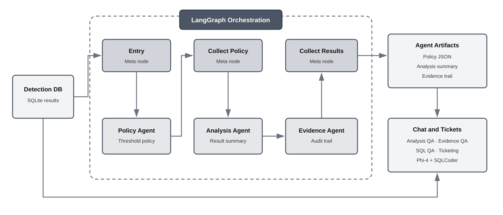

# Pipeline Run and Validation

The pipeline was validated through CLI inference runs, agent orchestration runs, chat-system checks, SQLite output inspection, and Web UI testing.


## Inference Validation

Inference can be run from the CLI with a use-case config file:

```bash
python run_inference_oep.py --config config/<use-case>/config.yaml
```

Examples:

```bash
python run_inference_oep.py --config config/gas_detection/config.yaml
python run_inference_oep.py --config config/oil_gas_pipeline/config.yaml
```

This verifies that the selected model and handler run successfully and that inference outputs are written to JSONL and SQLite.

> **NPU note:** OpenVINO detected the Intel NPU, and pipeline inference
> completed successfully on the NPU with outputs written to JSONL and SQLite.

## Agent Orchestration Validation

The LangGraph workflow follows a hub-and-spoke design. Meta-agent nodes
coordinate the policy, analysis, and evidence agents, while the generated
artifacts and SQLite records support chat queries and ticket generation.



Agent orchestration can be run after inference outputs are available:

```bash
python scripts/run_agent_orchestration.py --use-case <use-case>
```

Example:

```bash
python scripts/run_agent_orchestration.py --use-case oil_gas_pipeline
```

This verifies that the configured agents run successfully and produce artifacts such as policy, analysis, evidence, and use-case-specific summaries.

## Chat System Validation

The CLI chat interface can be launched with a use-case config:

```bash
python interactive_chat.py --config config/<use-case>/config.yaml
```

Example:

```bash
python interactive_chat.py --config config/oil_gas_pipeline/config.yaml
```

This verifies natural-language routing across analysis, evidence, SQL, and use-case-specific modes such as corrosion.

## Web UI Validation

The Web UI was also validated through the browser. The helper script provides commands to start, restart, stop, and check the server status.

To see the available Web UI commands:

```bash
python scripts/launch_web_app.py --help
```

To start the Web UI server:

```bash
python scripts/launch_web_app.py start
```

After the server starts, open the interface at:

```text
http://localhost:5000
```

To check whether the server is running:

```bash
python scripts/launch_web_app.py status
```

To restart the server after code or config changes:

```bash
python scripts/launch_web_app.py restart
```

To stop the server:

```bash
python scripts/launch_web_app.py stop
```

The Web UI validation checked that a use case can be selected, the pipeline can be started from the browser, outputs are displayed, and chat questions are routed to the expected backend mode.
