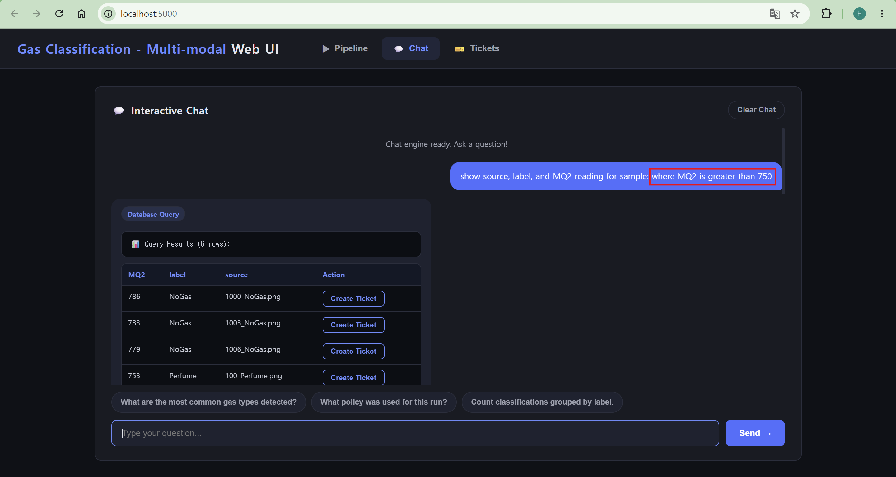

# Feature 2: Original Input Data Schema and Agent Support

This feature extended the database and agent layer so the pipeline can store original input data together with inference results. This makes the results easier to query, analyze, and explain through SQL and agents.

## Key Work

- Extended the configurable SQLite schema to support original input data and modality-specific metadata.
- Added support for storing raw input information together with prediction outputs.
- Added confidence fields that separate model-specific signals, such as image confidence and sensor confidence.
- Updated the SQL schema description so natural-language SQL queries can understand the new columns.
- Updated the policy and analysis layers so agent reports can use the added input and confidence information.
- Added tests to verify schema updates, SQL querying, and agent behavior.


## Result



The pipeline can now preserve more context for each prediction. Instead of storing only final labels and confidence scores, the database can also keep original input data and modality-specific confidence values. This allows users to ask more detailed natural-language questions and enables agents to produce more informative analysis reports.


## Example

Before this feature, a result row mainly represented the final prediction:

```text
source, label, confidence
```

After this feature, a result row can also include original input data and modality-specific confidence information:

```text
source, label, confidence, sensor_raw_json, image_confidence, sensor_confidence
```

This richer schema helps answer questions such as:

- Which samples had high sensor confidence?
- Which predictions relied more on image information?
- Which raw input values may explain the final prediction?


