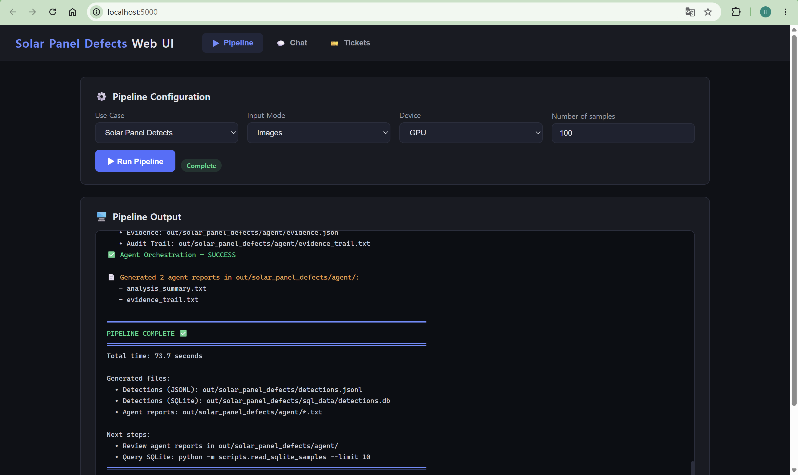

# Task 3b - Dataset A1: Solar Panel Defects

The Solar Panel Defects use case detects defects in single-channel electroluminescence images of solar cells.

## Dataset

- PVEL-AD solar cell anomaly detection dataset
- Modality: single-channel electroluminescence images
- Task: object detection
- Test set: 19,150 images with XML bounding-box annotations
- Source: [PVEL-AD](https://github.com/binyisu/PVEL-AD)

## Model

- YOLO-style object detection model exported to OpenVINO IR
- Input: `[1, 1, 640, 640]`
- Output: `[1, 16, 8400]`
  - 4 bounding-box coordinates
  - 12 defect-class scores
  - 8,400 candidate boxes
- Inference device: Intel integrated GPU using OpenVINO FP32

## Key Work

- Added the `solar_panel_defects` configuration, schema, prompts, and policy.
- Implemented `OpenVINODetectHandler` for single-channel YOLO inference, filtering, NMS, and coordinate restoration.
- Stored bounding-box detections in JSONL and SQLite with `modality_source: electroluminescence`.
- Integrated policy, analysis, and evidence agents with tested CLI and Web UI chat support.

## Validation

- Full evaluation on all 19,150 test images produced:
  - precision: 0.8789
  - recall: 0.7822
  - F1 score: 0.8277
- Inference on a 100-image serving sample produced:
  - 217 raw detections at the detector confidence threshold
  - 131 policy-kept detections at the 0.5 policy threshold
  - 86 filtered detections
- Analysis, evidence, and SQL chat modes were verified in both the CLI and Web UI.

## Use Case Result

The Solar Panel Defects use case was validated through OpenVINO object detection, JSONL and SQLite storage, agent-generated analysis and evidence reports, and CLI and Web UI chat queries.

