# Building an Agentic AI Predictive Maintenance Pipeline with Intel® OpenVINO and Intel® Metro AI Suite

Critical infrastructure (pipelines, utilities, and assets) requires continuous inspection to prevent failures, leaks, and safety incidents. Traditional maintenance is often reactive or schedule-based, which can require multiple truck rolls, miss early defect signals, and generate fragmented evidence for audits. Agentic AI enables continuous, autonomous oversight of critical infrastructure and assets and proactive maintenance. This reduces truck-roll costs, minimizes downtime, improves safety, and supports audit-ready operations.

This [GSoC project](https://summerofcode.withgoogle.com/programs/2026/projects/yvVZsgrT) leveraged the Intel® Metro AI Suite agentic predictive maintenance **[blueprint](https://docs.openedgeplatform.intel.com/dev/edge-ai-suites/ai-suite-metro/app-blueprint-predictive-maintenance.html)**, powered by Intel® OpenVINO, and expanded it with additional features and use cases based on new datasets.

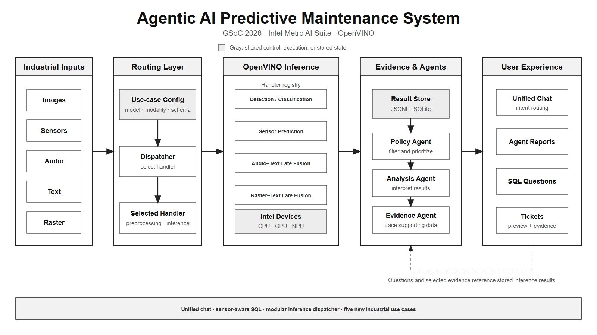

*Figure 1. The project connects industrial data, OpenVINO inference, coordinated agents, and actionable results.*

## About Me

Hello, my name is Hyeongseob Jo. I hold a master's degree, and my graduate research focused on machine learning applications in manufacturing. I currently work as a machine learning engineer. During Google Summer of Code 2026, I contributed to the Intel OpenVINO Toolkit organization by extending the Intel Metro AI Suite Predictive Maintenance Blueprint. My project focused on making the pipeline easier to use, explain, and extend across multiple industrial data modalities. Through this project, I also gained a deeper practical understanding of AI agents and how they can turn model outputs into actionable information.

## Abstract

Predictive-maintenance models can produce thousands of predictions, but an operator still needs answers: **What happened? Why did it happen? What should I inspect next?**

During Google Summer of Code 2026, I extended the Intel Metro AI Suite Predictive Maintenance Blueprint using OpenVINO. The result connects inference, structured storage, AI agents, natural-language questions, and maintenance evidence in one workflow.

**Keywords:** predictive maintenance, agentic AI, OpenVINO, multimodal inference, Intel hardware, Google Summer of Code

## 1. Introduction: From Predictions to Maintenance Decisions

Critical Infrastructure AI systems need more than isolated model predictions. A practical pipeline must preserve the evidence behind each result, support different input modalities, and help users investigate outputs without requiring detailed knowledge of the underlying implementation.

My GSoC project addressed this gap by improving both the user experience and the internal architecture of an existing predictive-maintenance blueprint. The work connected model inference with structured storage, coordinated AI agents, natural-language interaction, and evidence-based ticket generation.

The upstream repository provided the foundation that I extended throughout the project.

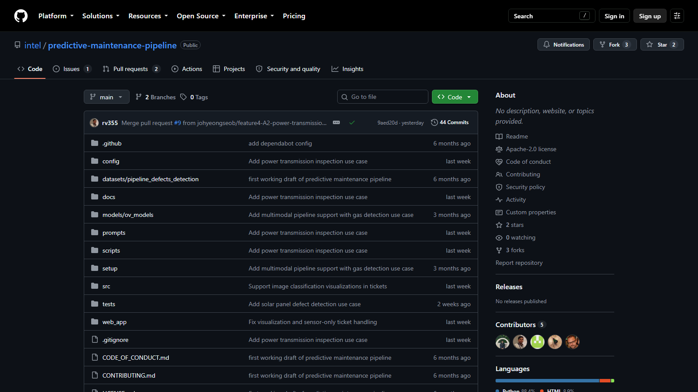

*Figure 2. Intel® Metro AI Predictive Maintenance Blueprint GitHub repository, which served as the upstream project for this work.*

The repository combines OpenVINO inference, structured storage, and agent orchestration in an edge AI predictive-maintenance blueprint.

This article presents the design and results visually. Full implementation details, validation notes, and upstream contributions are collected in the **Resources** section at the end of this article.

## 2. System Architecture: One Pipeline for Multiple Industrial Modalities

The pipeline first runs an OpenVINO model and stores its results in JSONL and SQLite. A LangGraph workflow then coordinates policy, analysis, and evidence agents. Finally, users explore the results through chat or create a ticket with supporting evidence. 

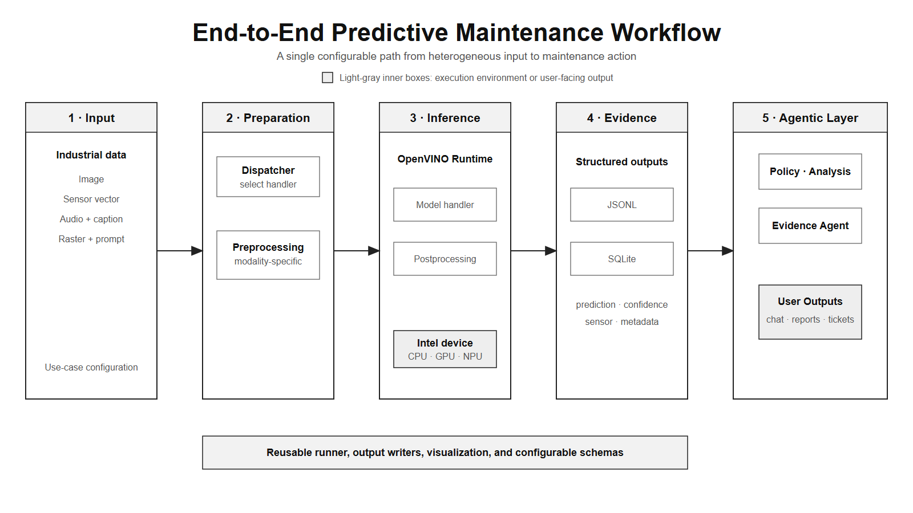

*Figure 3. A configurable path transforms industrial inputs into information that users can inspect and act upon.*

The project was organized around four improvements.

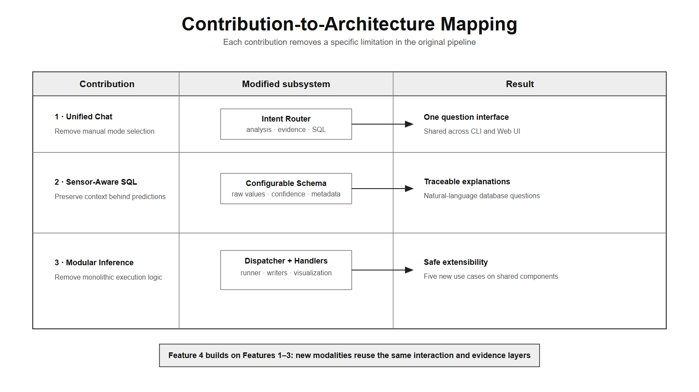

*Figure 4. The four contributions improve usability, explainability, extensibility, and application coverage.*

Each contribution addresses a different gap while remaining part of the same end-to-end workflow.

## 3. Core Contributions: Making the Pipeline Easier to Use and Extend

### 3.1 One Question Interface: Unifying Analysis, Evidence, and SQL

Before this work, users had to choose analysis, evidence, or SQL mode before asking a question.

  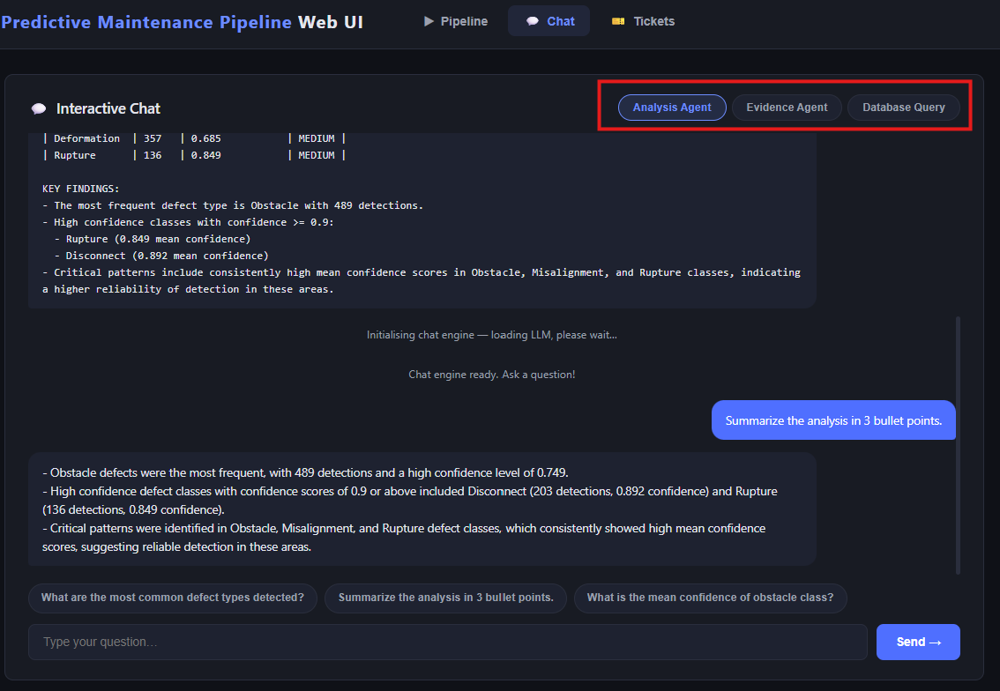

*Figure 5. Before intent routing, the user had to understand the internal modes.*

The mode selector exposed implementation details that users had to choose correctly before asking a question.

The new interface detects intent and selects the appropriate backend automatically. The same experience works in both the CLI and Web UI.

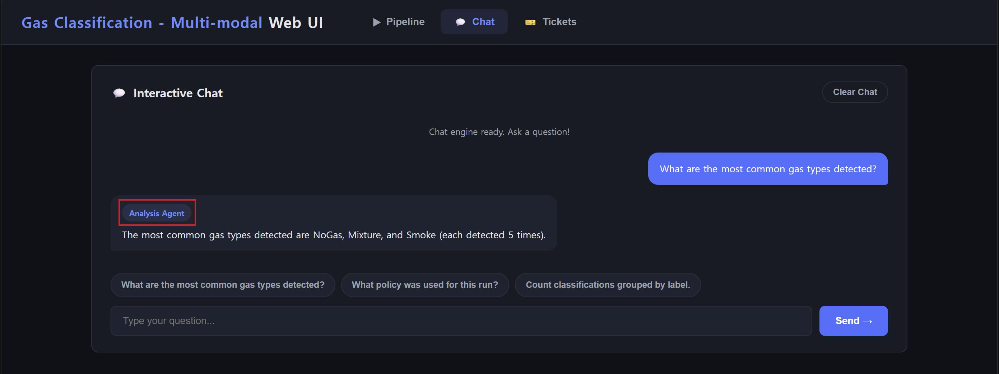

*Figure 6. After intent routing, the user simply asks a question.*

Intent routing now sends the question to analysis, evidence, or SQL without requiring a manual mode choice.

### 3.2 Asking Questions About Raw Sensor Data in Natural Language

A label and confidence score rarely tell the whole story. I extended the configurable SQLite schema to retain raw sensor readings, modality-specific confidence values, and use-case metadata.

This lets users ask practical questions such as: “Which samples had higher sensor confidence than image confidence?” The same context is also available to the policy and analysis agents.

*Figure 7. A natural-language condition is translated into a database query that returns the matching sensor readings, labels, and source records.*

The important detail is that stored raw values and metadata make the returned answer traceable to its source records.

### 3.3 Adding New Models Without Rebuilding the Pipeline

The original inference entry point contained many responsibilities. I separated configuration, dispatch, model-specific handlers, execution, output writing, and visualization. A dispatcher now selects a focused handler while shared components manage common pipeline behavior.

This refactoring made the next step possible: adding very different data types without rebuilding the pipeline for every use case.

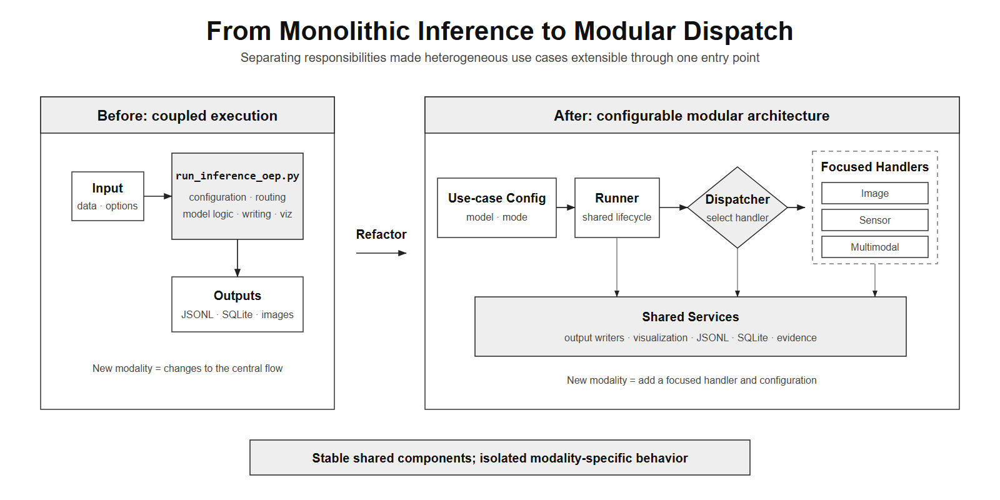

*Figure 8. The monolithic inference entry point was refactored into a dispatcher, focused handlers, and shared output components.*

New modalities can therefore be introduced through a focused handler and configuration while reusing the common lifecycle.

## 4. Five Industrial Use Cases, One Shared Pipeline

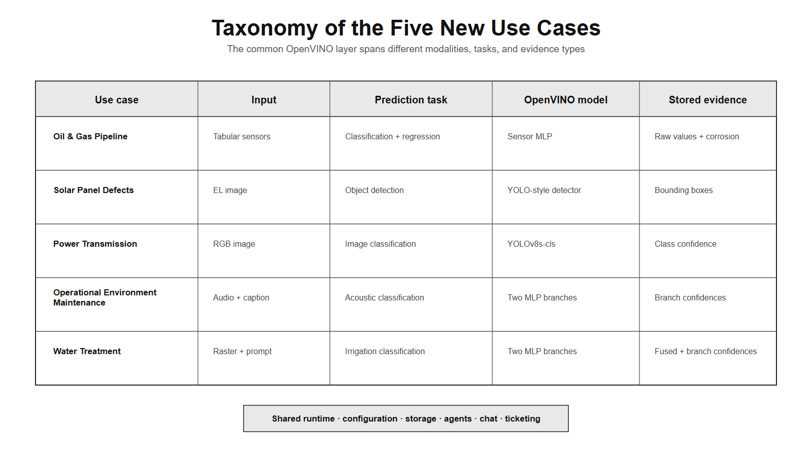

*Figure 9. A shared OpenVINO inference layer supports five use cases across four input patterns.*

The inputs, prediction tasks, and evidence differ, but all five use cases share the same surrounding runtime.

### 4.1 Oil and Gas Pipelines: Predicting Condition and Thickness Loss

Tabular operating and material data feeds an OpenVINO MLP that predicts both pipeline condition and thickness loss. The workflow also provides corrosion-focused analysis.

Two representative records show the main geometric, material, operating, and corrosion-related inputs. The bold values are the ground-truth targets for pipeline condition and thickness loss.

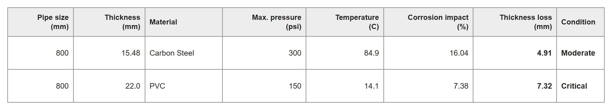

*Table 1. Sample oil and gas pipeline inference results showing predicted thickness loss and condition.*

During inference, each processed record produces two complementary outputs: a pipeline-condition class and an estimated thickness-loss value. The flow below shows how both predictions remain connected to their source measurements.

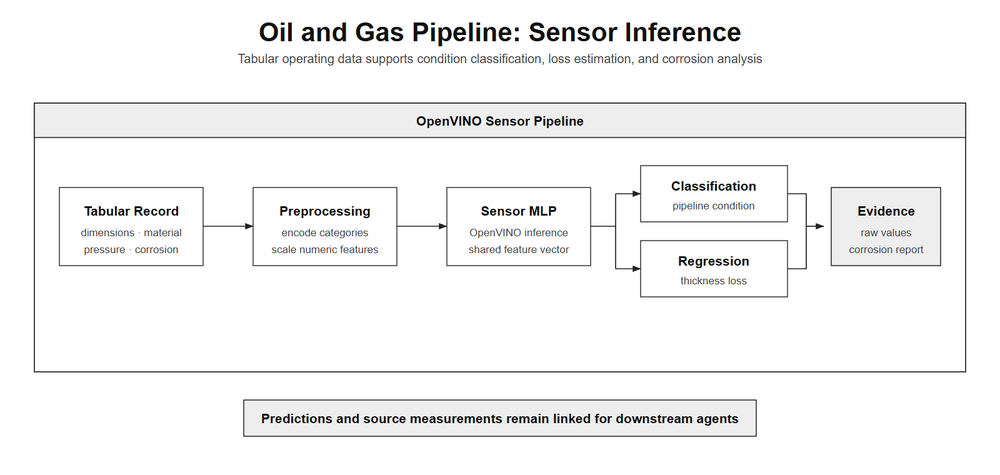

*Figure 10. Tabular sensor preprocessing, OpenVINO inference, prediction, and evidence generation.*

Keeping both predictions linked to the input record allows downstream agents to explain the result with the original operating and corrosion-related values.

### 4.2 Solar Panels: Detecting Defects with Visual Evidence

A YOLO-style OpenVINO detector finds defects in single-channel solar-cell electroluminescence images and preserves bounding boxes as evidence.

  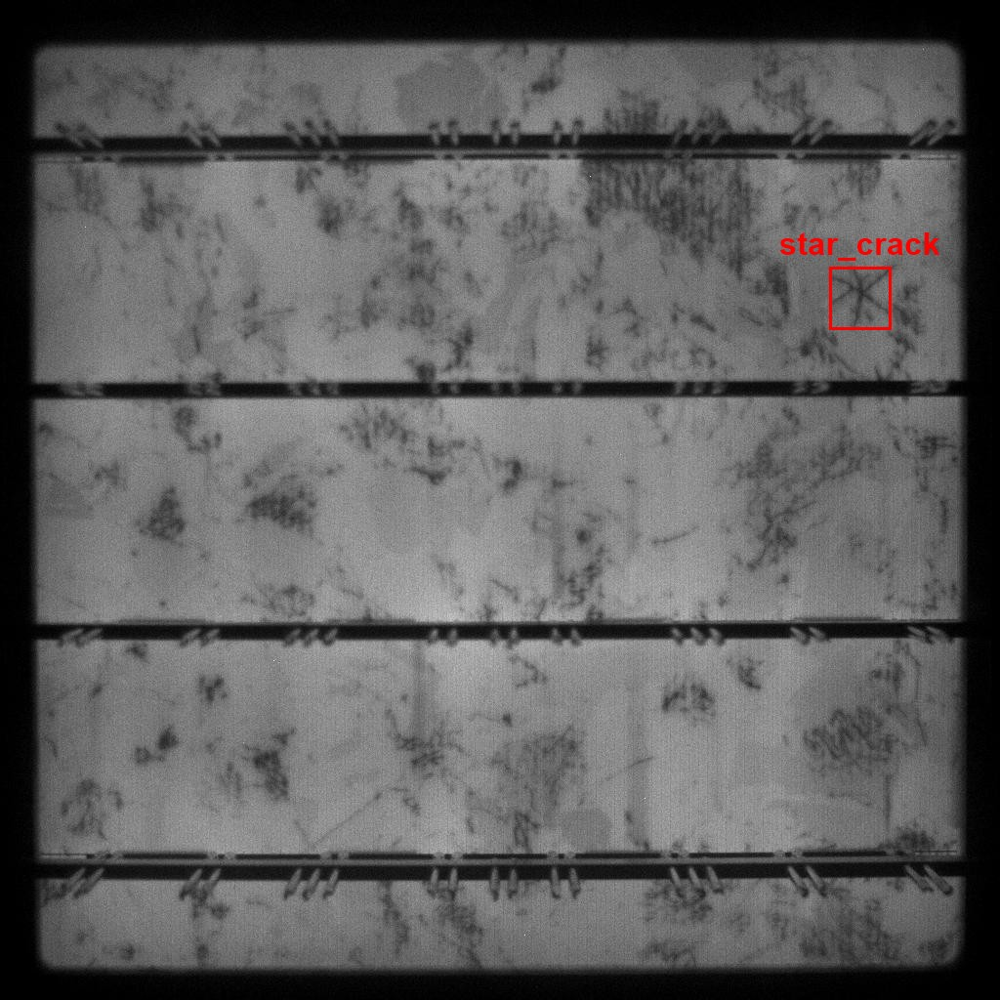

*Figure 11. The red box marks a ground-truth `star_crack` defect.*

This sample illustrates the localized evidence that the detector is expected to recover.

The reproduced evaluation covered all 19,150 test images and achieved **0.8277 F1**.

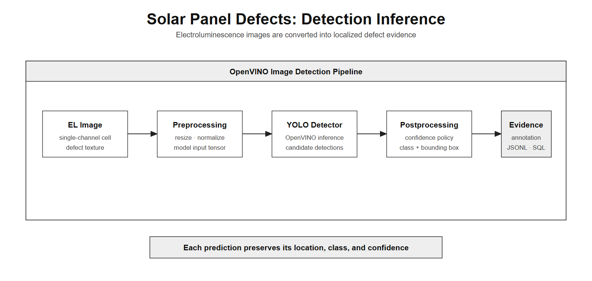

*Figure 12. Electroluminescence image preprocessing, OpenVINO detection, and bounding-box evidence generation.*

The predicted box is preserved with the class and confidence so users can inspect where the defect was detected.

### 4.3 Power Transmission: Classifying Component Conditions

A fine-tuned YOLOv8s-cls model classifies synthetic and real-world transmission-line images into three circuit categories. It correctly classified 334 of 348 held-out images, for **0.9598 accuracy**.

  
  

*Figure 13. Synthetic (left) and real-world (right) samples from the Power Transmission Line Dataset.*

The two domains test whether the same classifier can handle rendered circuit views and field inspection images.

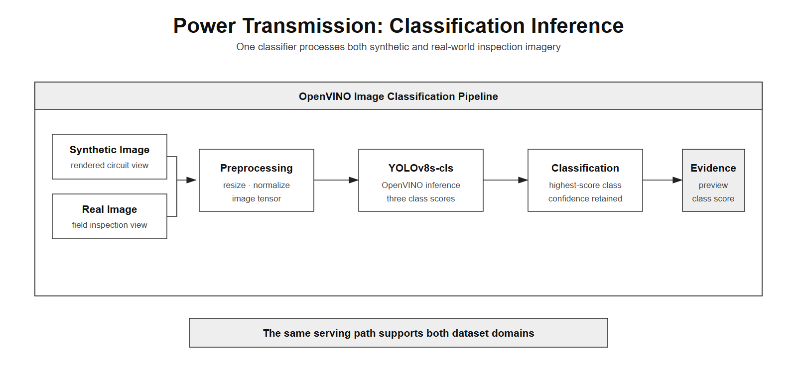

*Figure 14. A shared OpenVINO classification path processes synthetic and real-world inspection images.*

Both image sources use identical preprocessing and inference stages to produce a circuit-condition class.

### 4.4 Operational Environment Maintenance: Combining Audio and Text

*(**Manufacturing Maintenance** in the GitHub repository.)*

This use case pairs an audio clip with its caption. The audio and text paths are preprocessed separately, classified by two OpenVINO MLP branches, and combined through late fusion.

  

<em>Paired text caption: “A power tool vibrates as it runs.”</em>

*Figure 15. Representative video frame from the multimodal sample labeled **`rotating_machinery`** and paired with the caption “A power tool vibrates as it runs.”*

The visible frame provides context, while the inference input combines the clip's audio with its text caption.

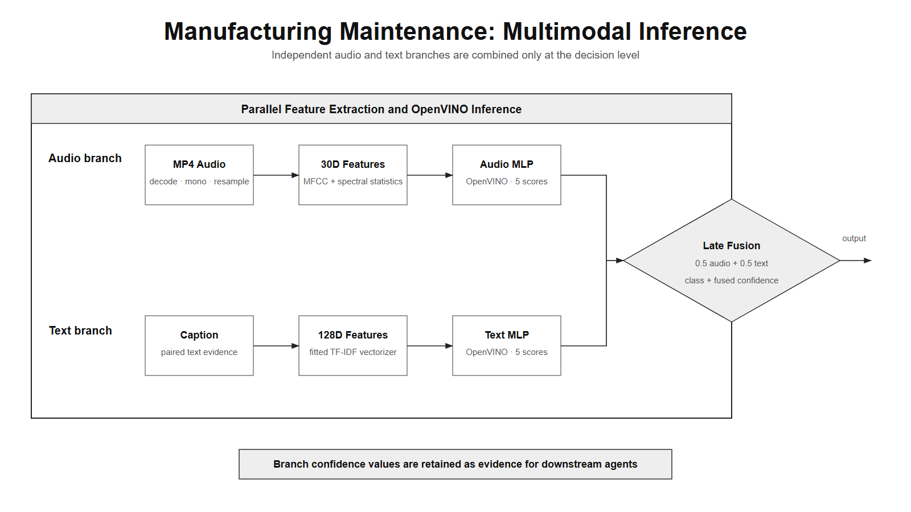

*Figure 16. Audio and text preprocessing, OpenVINO inference, and late fusion.*

The two branches remain independently inspectable until their scores are combined into one prediction.

### 4.5 Water Treatment: Combining Raster Data and Text

This workflow pairs a 15-channel Sentinel-2 raster patch with an environmental text prompt. Statistical raster features and TF-IDF text features pass through separate OpenVINO branches before late fusion.

  

*Paired environmental prompt (summary): “Cochise County, Arizona. Evapotranspiration: 81.26 mm; precipitation: 0.00 in; groundwater depth: 221.64 ft; surface-water depth: 7.23 ft.”*

*Figure 17. A JPEG preview helps users inspect the sample; the model uses the original multichannel NumPy raster.*

The preview is visual evidence for the reader rather than a replacement for the model's 15-channel input.

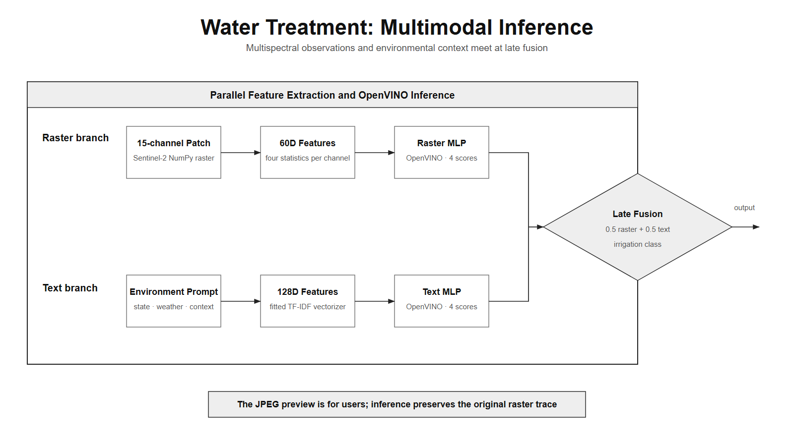

*Figure 18. Raster and text preprocessing, OpenVINO inference, and late fusion.*

Late fusion combines the raster and prompt scores while retaining the confidence produced by each branch.

The pipeline can also attach the raster preview to a ticket, connecting a multimodal prediction to visible evidence.

## 5. Deploying OpenVINO Models Across Intel Hardware

All inference models were deployed in OpenVINO IR format. Depending on the use case, the pipeline handles images, tabular sensor vectors, audio features, or paired multimodal inputs through the same configurable entry point.

The code was validated on an Intel **GPU**, and pipeline inference was also confirmed on an Intel **NPU**, including JSONL and SQLite output generation.

## 6. Validation: Testing the Complete Workflow

I tested more than model accuracy. Each workflow was checked from model loading and structured output to agents, user interfaces, evidence, tickets, and Intel hardware execution.

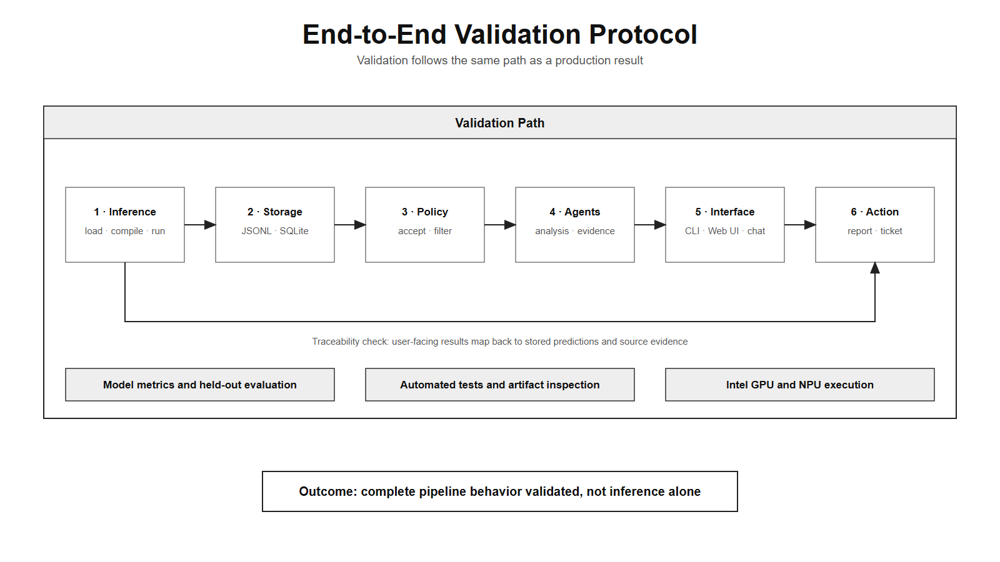

*Figure 19. Validation covered every layer from inference to user-facing action.*

These tests verified both the integration boundaries and the individual model outputs.

## 7. Demo: From Inference Results to User Interaction

The following demonstrations present two complementary views of the validated system: backend agent orchestration and user-facing interaction through the unified chat interface.

*Figure 20. The orchestration workflow connects stored inference results with the policy, analysis, and evidence agents.*

The orchestration demo begins with inference results stored in the shared data layer. The policy agent filters the results according to the configured policy, while the analysis agent summarizes their operational meaning. The evidence agent organizes each inference result together with its associated source data and metadata into a traceable evidence record. Together, these agents transform stored model outputs into structured analysis and evidence that users can review.

*Figure 21. The unified chat system lets users explore stored predictions and supporting evidence through one question interface.*

The unified chat demo shows how users interact with stored predictive-maintenance results through a single interface. Users can review analysis summaries, inspect evidence and filtering results, and query structured maintenance data. After investigating the results, they can create a maintenance ticket for follow-up action. This demonstrates the user-facing workflow from result exploration to ticket generation.

## 8. Discussion

A central design challenge was balancing reuse with modality-specific behavior. The five use cases share configuration, execution, storage, and agent components, while focused handlers preserve the preprocessing and postprocessing required by each data type. This structure reduces duplication without forcing fundamentally different inputs through identical logic.

The results also show why a maintenance pipeline should retain more than a predicted label. Raw sensor values, bounding boxes, branch confidences, metadata, and source previews keep each result connected to evidence that users and downstream agents can inspect.

For the multimodal use cases, late fusion keeps the audio, text, and raster branches independently traceable. The current equal weighting is simple and reproducible, but learned or dynamically calibrated weights could better reflect the reliability of each modality in future deployments.

The agentic layer does not replace the predictive models. It organizes stored results, retrieves supporting evidence, and routes user questions to the appropriate analysis or database operation. The completed validation demonstrates this integrated workflow on the evaluated datasets and Intel hardware; production use would still require site-specific testing, monitoring, and calibration.

## 9. Conclusion: From a Prototype to an Extensible Blueprint

This project transformed a use-case-specific predictive-maintenance pipeline into a more modular, multimodal, and user-oriented system. OpenVINO provides the common inference layer, while structured storage and coordinated agents help turn model outputs into information that users can inspect and act upon.

The completed work demonstrates a reusable path from industrial data to inference, evidence, natural-language exploration, and ticket generation across multiple predictive-maintenance domains.

## Resources

**Project links**

- [GSoC 2026 project summary](https://github.com/johyeongseob/gsoc-2026)
- [Intel Predictive Maintenance Pipeline](https://github.com/intel/predictive-maintenance-pipeline)
- [Google Summer of Code project page](https://summerofcode.withgoogle.com/programs/2026/projects/yvVZsgrT)

**Upstream pull requests**

- [PR #5 — Unified chat, sensor-aware SQL, and modular inference](https://github.com/intel/predictive-maintenance-pipeline/pull/5)
- [PR #6 — Oil and Gas Pipeline](https://github.com/intel/predictive-maintenance-pipeline/pull/6)
- [PR #8 — Solar Panel Defects](https://github.com/intel/predictive-maintenance-pipeline/pull/8)
- [PR #9 — Power Transmission Inspection](https://github.com/intel/predictive-maintenance-pipeline/pull/9)
- [PR #10 — Manufacturing Maintenance and Water Treatment](https://github.com/intel/predictive-maintenance-pipeline/pull/10)

The project summary contains feature-level documentation, dataset examples, validation details, and architecture figures.

## Acknowledgments

I would like to thank my Intel mentors, **Hassnaa Moustafa, Anand Bodas, and Rohit Verma**, for their guidance and support throughout Google Summer of Code 2026.

I am grateful to **Vijay Chandrashekar** for providing and supporting the Intel cloud environment used during the project.

I would also like to thank **Zhuo Wu**, Intel's GSoC program manager, for coordinating the program meetings and guiding the Medium publication process.

Finally, I thank the Intel OpenVINO team and the Google Summer of Code program administrators for making this open-source contribution and learning experience possible.
